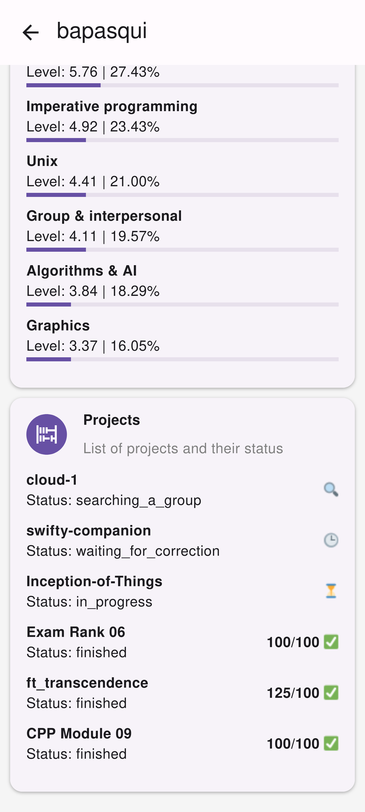

# 42_swifty-companion

The aim of the project is to build an application that will retrieve the information of 42 students,
using the 42 API. 

Made in `react-native` with `react-native-paper` UI library.

## Features

- Search for a student with their login
- Access their skills and projects
- Display their profile pic, login, email, wallet, correction_points and their locations
- Use 42API

## Screenshots

<div>
    
    
    
    
</div>


## DEVELOPMENT

```bash
## this will launch the android emulator and ask for .env if does not exist
NIXPKGS_ALLOW_UNFREE=1 nix-shell
```

```bash
## .env
EXPO_PUBLIC_CLIENT_ID=
EXPO_PUBLIC_CLIENT_SECRET=
```
